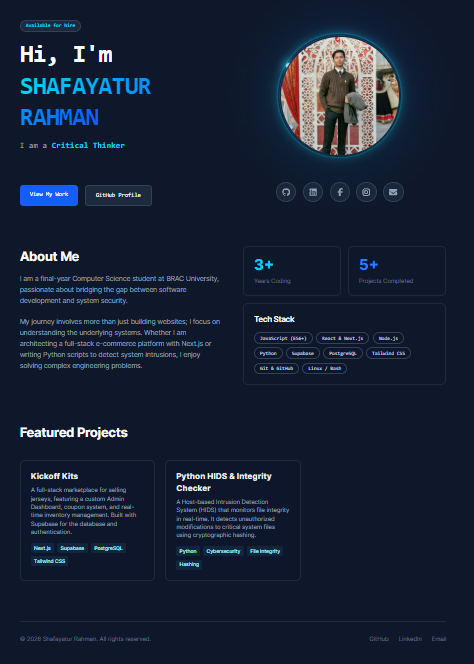
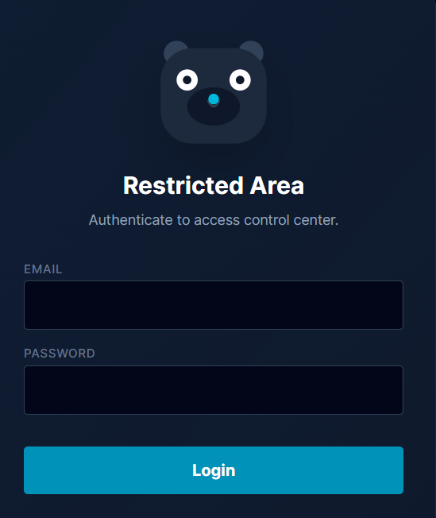
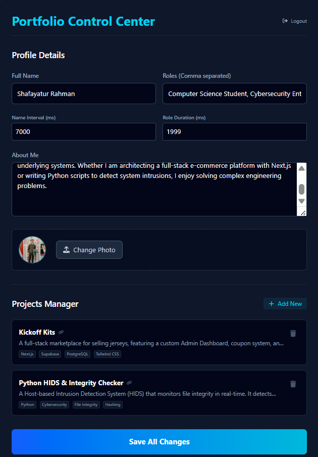

# 🔐 Cyber-Sec Portfolio & Admin Console

   

A highly interactive, full-stack portfolio designed for a Cybersecurity and Computer Science student. This project goes beyond a static site, featuring a secure **Admin Control Center** that allows real-time updates to the portfolio content without touching the codebase.

## ⚡ Live Demo
**[View the Portfolio Live](https://shafayatur-portfolio.vercel.app/)**

---

## 🚀 Key Features

### 🎨 Frontend Experience
* **Cybersecurity Theme:** Custom animations including binary text scrambling, orbiting scanners, and terminal-style typography.
* **Interactive Mascot:** A "Cyber-Bear" login mascot that tracks cursor movement and reacts to password input privacy.
* **Fully Responsive:** optimized layouts for mobile (stacked view) and desktop (split view).

### 🛡️ Backend & Admin Panel
* **Secure Authentication:** Powered by **Supabase Auth** to protect the dashboard.
* **Dynamic Content Management:**
    * **Live Text Editing:** Update Bio, Roles, and Name speed intervals instantly.
    * **Project Manager:** Add, edit, or delete portfolio projects dynamically.
    * **Image Editor:** Built-in cropping tool (zoom/pan) to upload perfectly circular profile pictures directly to Supabase Storage.
* **Database Driven:** All content is fetched server-side from a PostgreSQL database.

---

## 🛠️ Tech Stack

| Component | Technology |
| :--- | :--- |
| **Framework** | Next.js 14 (App Router) |
| **Styling** | Tailwind CSS + Framer Motion |
| **Backend** | Supabase (PostgreSQL) |
| **Auth** | Supabase Auth |
| **Storage** | Supabase Bucket (Image Hosting) |
| **Image Process** | React Easy Crop + HTML5 Canvas |
| **Deployment** | Vercel |

---

## 📸 Screenshots

### 1. The Public Portfolio

### 2. The Login Guard

### 3. The Admin Dashboard

---